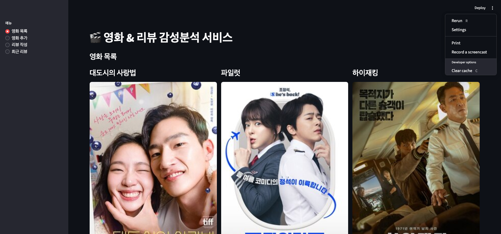
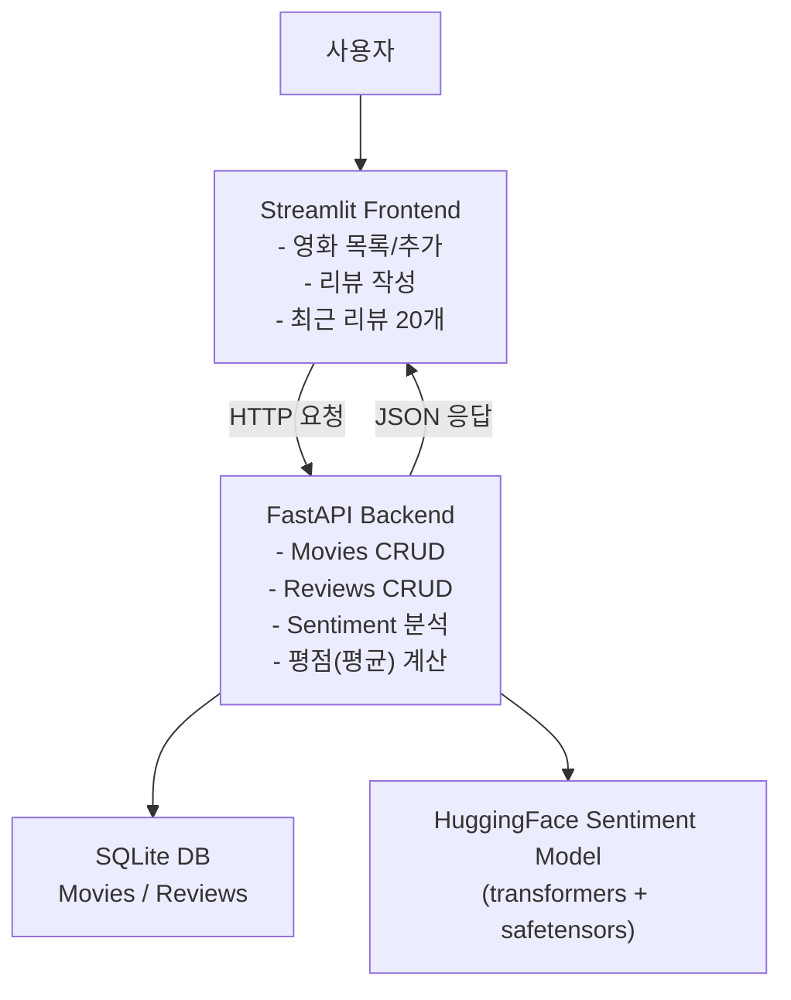
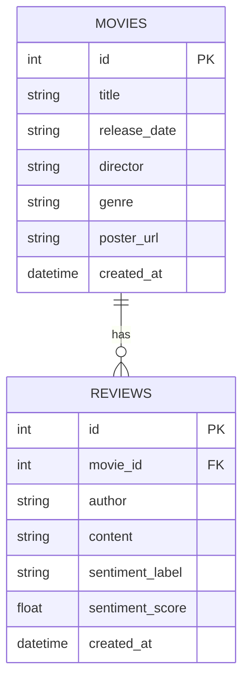

✅ [결과물 클릭](https://huggingfacesentimentappfastapi-y66azogspdp9gohrzrfxrr.streamlit.app/)


# 🎬 HuggingFace 감성분석 영화 리뷰 앱 (Streamlit + FastAPI)

영화 등록 + 리뷰 작성을 웹에서 처리하고,  
리뷰가 저장되는 순간 HuggingFace 감성분석이 자동실행되어 결과(라벨/점수)까지 함께 보여주는  
end-to-end 서비스 구조를 완성했습니다.

- 프론트엔드: `Streamlit`
- 백엔드: `FastAPI`
- 감성분석: `Hugging Face Transformers` 기반 한국어 감성분석 모델(safetensors 로딩)
- 데이터 저장: SQLite(로컬), 배포 시 환경에 따라 변경 가능

---

## 🧭 서비스 구조도 (Frontend ↔ Backend ↔ DB ↔ Sentiment)



---

## 🗺️ 프로젝트 동작 흐름


## ✅ 주요 기능

1) 영화 관리 (FastAPI)
- 영화 등록: 제목, 개봉일, 감독, 장르, 포스터 URL
- 영화 목록/상세 조회
- 영화 삭제

2) 리뷰 관리 (FastAPI)
- 리뷰 등록: 작성자, 리뷰 내용, 영화 선택
- 리뷰 조회:
    - 전체 리뷰(최근 N개)
    - 특정 영화 리뷰
- 리뷰 삭제

3) 감성분석 자동 실행
- 리뷰 작성 시 백엔드에서 자동으로 감성분석 수행
- 결과 저장:
    - sentiment_label (POSITIVE/NEGATIVE/ERR)
    - sentiment_score (0~1)

4) 평점 조회
- 영화별 리뷰 감성 점수의 평균으로 “평점” 제공


---

## 🔍 데이터베이스 구조 (ERD)


---

## 🚀 로컬 실행 방법

1) 백엔드 실행 (FastAPI)

```bash
cd backend
python -m venv .venv
source .venv/bin/activate

pip install -r requirements.txt
uvicorn app.main:app --reload --port 8000
```
`FastAPI Docs: http://localhost:8000/docs`


2) 프론트 실행 (Streamlit)
   
```bash
cd frontend
python -m venv .venv
source .venv/bin/activate

pip install -r requirements.txt
streamlit run app.py
```
`Streamlit: http://localhost:8501`

---

## ☁️ 배포 ① Render (FastAPI 백엔드)

- 핵심:
    - Render에서는 host=0.0.0.0 + port=$PORT 로 띄워야 합니다.
    - uvicorn이 backend/requirements.txt에 포함되어 있어야 합니다.

- Render 설정값
    - Service Type: Web Service
    - Root Directory: backend
- Build Command:
```bash
pip install -r requirements.txt
```

- Start Command:
```bash
uvicorn app.main:app --host 0.0.0.0 --port $PORT
```

- 배포가 완료되면 Render가 이런 형태의 URL을 줍니다:
    - YOUR_RENDER_BACKEND_URL_HERE (예: https://xxxx.onrender.com)

- ✅ 배포 확인:
    - YOUR_RENDER_BACKEND_URL_HERE/docs
    - Render 무료 플랜은 “슬립”이 있을 수 있어서 첫 요청이 느릴 수 있습니다.


## ☁️ 배포 ② Streamlit Community Cloud (프론트)

1) Streamlit Cloud 설정
- Main file path: frontend/app.py

2) Secrets에 BACKEND_URL 넣기
- Streamlit Cloud → App settings → Secrets에 아래를 그대로 붙여넣기:

```toml
BACKEND_URL="YOUR_RENDER_BACKEND_URL_HERE"
````

3) 프론트 코드(환경변수/시크릿 자동 대응)

```python
import os
import streamlit as st

BACKEND_URL = st.secrets.get("BACKEND_URL", os.getenv("BACKEND_URL", "http://localhost:8000"))
```

---

## 🤖 감성분석 모델 적용 방식

리뷰 등록 시, 사용자가 기다리지 않게 하기 위해
- FastAPI에서 모델을 1회 로딩(캐싱) 후 재사용
- 리뷰 저장 시점에 감성분석을 수행하고 DB에 함께 저장

또한 개발 과정에서
- 환경/의존성 문제로 모델 로딩이 실패할 수 있었고,
- 서비스가 500으로 죽는 것을 막기 위해 fallback(ERR, 0.0)을 적용했습니다.

---

## 🧯 개발 과정에서 겪은 오류 & 해결 기록

1) Streamlit → FastAPI 연결 오류 (Connection refused)
- 증상: /movies 호출 시 Connection refused
- 원인: FastAPI 미실행 / 포트 불일치 / 배포 환경에서 localhost 사용
- 해결: 백엔드를 먼저 실행 + 배포 시 BACKEND_URL을 secrets로 분리

2) 리뷰 등록 시 500 (Internal Server Error)
- 증상: 리뷰 등록 시 서버 내부 에러
- 원인: 감성분석 모델 로딩/의존성 문제로 예외 발생
- 해결: safetensors 로딩 + fallback 로직으로 서비스 안정화

3) NumPy 호환 경고
- 증상: NumPy 2.x 호환 경고로 torch import 시 경고/불안정
- 해결: numpy<2로 핀 고정하여 안정화


