```mermaid
flowchart TB
    U["사용자"]
    FE["Streamlit Frontend<br/>- 영화 목록/추가<br/>- 리뷰 작성<br/>- 최근 리뷰 20개"]
    BE["FastAPI Backend<br/>- Movies CRUD<br/>- Reviews CRUD<br/>- Sentiment 분석<br/>- 평점(평균) 계산"]
    DB["SQLite DB<br/>Movies / Reviews"]
    HF["HuggingFace Sentiment Model<br/>(transformers + safetensors)"]

    U --> FE
    FE -->|HTTP 요청| BE
    BE --> DB
    BE --> HF
    BE -->|JSON 응답| FE
```

# ✅ [결과물 클릭](YOUR_STREAMLIT_URL_HERE)


# 🎬 HuggingFace 감성분석 영화 리뷰 앱 (Streamlit + FastAPI)

이 프로젝트는 영화 등록 → 리뷰 작성 → 감성분석 자동 실행 → 최근 리뷰/영화별 리뷰 조회까지 가능한
end-to-end 웹 애플리케이션입니다.

프론트엔드: Streamlit

백엔드: FastAPI

감성분석: Hugging Face Transformers 기반 한국어 감성분석 모델

데이터 저장: SQLite(로컬) (배포 시 환경에 따라 변경 가능)

---

🧭 서비스 구조도 (Frontend ↔ Backend ↔ DB ↔ Sentiment)



---

✅ 주요 기능
1) 영화 관리 (FastAPI)

영화 등록: 제목, 개봉일, 감독, 장르, 포스터 URL

영화 목록/상세 조회

영화 삭제

2) 리뷰 관리 (FastAPI)

리뷰 등록: 작성자, 리뷰 내용, (연결된 영화 선택)

리뷰 조회:

전체 리뷰(최근 N개)

특정 영화 리뷰

리뷰 삭제

3) 감성분석 자동 실행

리뷰 작성 시 백엔드에서 자동으로 감성분석 수행

결과 저장:

sentiment_label (POSITIVE/NEGATIVE/ERR)

sentiment_score (0~1)

4) 평점(평균) 조회 (심화)

영화별 리뷰 감성 점수의 평균으로 “평점” 제공
(예: POSITIVE score 평균, 또는 POS/NEG를 가중 평균으로 확장 가능)

---

🗂️ 폴더 구조

HuggingFace_Sentiment_Streamlit_FastAPI/
  frontend/
    app.py
    requirements.txt
  backend/
    app/
      main.py
      ...
    requirements.txt
  report/
    report.pdf   (제출용)
  README.md


🔍 데이터베이스 구조 (ERD)


🚀 로컬 실행 방법
1) 백엔드 실행 (FastAPI)
```bash
cd backend
python -m venv .venv
source .venv/bin/activate

pip install -r requirements.txt
uvicorn app.main:app --reload --port 8000
```
FastAPI Docs: http://localhost:8000/docs


2) 프론트 실행 (Streamlit)
```bash
cd frontend
python -m venv .venv
source .venv/bin/activate

pip install -r requirements.txt
streamlit run app.py
```
Streamlit: http://localhost:8501


☁️ 배포 1) Render (FastAPI 백엔드)

핵심: Render에서는 host=0.0.0.0 + port=$PORT 로 띄워야 합니다.
그리고 uvicorn이 backend/requirements.txt에 포함되어 있어야 합니다.

Render 설정값 (그대로 입력)

Service Type: Web Service

Root Directory: backend

Build Command:
pip install -r requirements.txt

Start Command:
uvicorn app.main:app --host 0.0.0.0 --port $PORT

배포가 완료되면 Render가 이런 형태의 URL을 줍니다:

YOUR_RENDER_BACKEND_URL_HERE (예: https://xxxx.onrender.com)

✅ 배포 확인:

YOUR_RENDER_BACKEND_URL_HERE/docs

⚠️ Render 무료 플랜은 “슬립”이 있을 수 있어서 첫 요청이 느릴 수 있습니다.


☁️ 배포 2) Streamlit Community Cloud (프론트)
1) Streamlit Cloud 설정

Main file path: frontend/app.py

2) Secrets에 BACKEND_URL 넣기

Streamlit Cloud → App settings → Secrets에 아래를 그대로 붙여넣기:

```toml
BACKEND_URL="YOUR_RENDER_BACKEND_URL_HERE"
````

3) 프론트 코드(환경변수/시크릿 자동 대응)

frontend/app.py에서 백엔드 URL은 아래 방식 권장:
```python
import os
import streamlit as st

BACKEND_URL = st.secrets.get("BACKEND_URL", os.getenv("BACKEND_URL", "http://localhost:8000"))
```

🤖 감성분석 모델 적용 방식

리뷰 등록 시 백엔드에서 감성분석을 수행하고 결과를 DB에 저장합니다.

모델 로딩이 실패해도 서비스가 500으로 죽지 않도록 fallback(ERR, 0.0) 방어 로직을 적용했습니다.


🧯 개발 과정에서 겪은 오류 & 해결 기록 (보고서에 그대로 쓰기)
1) Front ↔ Back 연결 오류 (Connection refused)

증상: Streamlit에서 /movies 호출 시 Connection refused

원인: FastAPI 미실행 / 포트 불일치 / 배포 환경에서 localhost 사용

해결: 백엔드 먼저 실행 + 배포 시 BACKEND_URL을 Secrets로 분리

2) Transformers 모델 로딩 오류 (환경 제약)

증상: 리뷰 등록 시 500(Internal Server Error)

원인: 모델 로딩 단계에서 환경/의존성 문제

해결: safetensors 기반 로딩 + fallback 로직으로 서비스 안정화

3) NumPy 호환 경고

증상: “NumPy 2.x에서 1.x 기반 모듈 실행 경고”

해결: numpy<2로 핀 고정하여 안정화


📸 제출 증빙 체크리스트

 FastAPI Docs 전체 캡쳐 (/docs)

 서비스 동작 캡쳐:

 영화 3개 이상 등록 화면

 각 영화별 리뷰 10개 이상 등록 화면

 최근 리뷰 20개 화면 (영화 제목 표시)

 보고서 PDF: 구조도/ERD/오류 해결 기록 포함

 코드: frontend/, backend/ 폴더 구분 제출